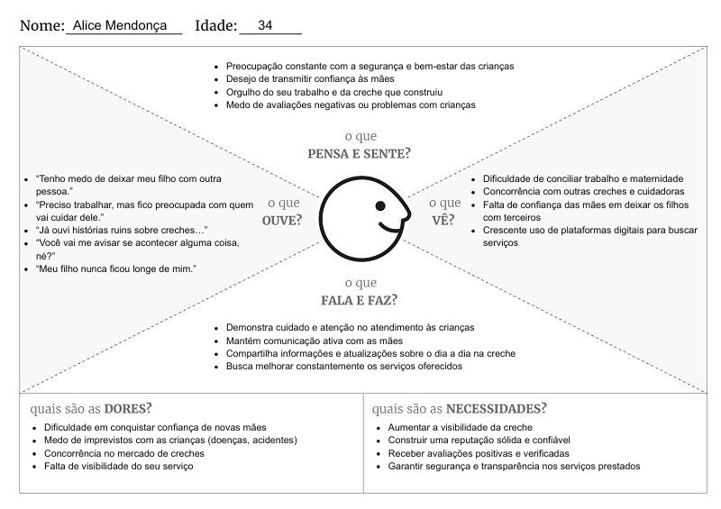

# 4. PROJETO DO DESIGN DE INTERAÇÃO

## 4.1 Personas
Nesta seção você deve detalhar as personas do seu projeto. Deve-se documentar uma persona por integrante do projeto. Para mais informações sobre personas consulte: https://www.rdstation.com/blog/marketing/persona-o-que-e/. Sugere-se a utilização de um template do Canva: https://www.canva.com/pt_br/modelos/s/persona/

## *Tereza Martins  - Creche Mundo Encantado (Tia da limpeza)*

Tereza tem 48 anos e trabalha na limpeza da Creche Mundo Encantado. Mesmo atuando na área de limpeza, ela tem um carinho muito grande pelas crianças e gosta de estar em um ambiente onde pode contribuir, mesmo que de forma indireta, para o bem-estar delas. É uma pessoa simples, dedicada e que valoriza o cuidado com o próximo.
O papel de Tereza não é só deixar a creche limpa, mas sim ajudar, influenciar e encorajar as mães pela plataforma.

## *Dr. Rafael Mendes*

Dr. Rafael Mendes é um psicólogo de 40 anos, especializado em desenvolvimento infantil. Ele trabalha ajudando mães, principalmente mães solo, a lidarem com os desafios de cuidar dos filhos.

Seu objetivo na aplicação é apoiar as mães emocionalmente, ajudando no dia a dia com a criação dos filhos, orientando sobre educação, comportamento e bem-estar das crianças. Ele também busca ajudar os filhos a crescerem de forma saudável, mesmo sem a presença paterna, oferecendo suporte psicológico tanto para as mães quanto para as crianças.

## *Dr. João Victor Pele*
Joao Victor Pele tem 50 anos, mora no Rio de Janeiro e é conhecido por ser uma pessoa empática, paciente e comprometida com causas sociais. Ele valoriza a justiça, acredita na importância da família e se sensibiliza com histórias de mães que enfrentam dificuldades sozinhas para criar seus filhos.

Sua atuação é voltada ao apoio jurídico de mães. Ele trabalha com casos como pensão alimentícia, guarda de filhos, reconhecimento de paternidade e situações de vulnerabilidade social. Seu diferencial está no atendimento humanizado, na linguagem simples e no uso de canais digitais para facilitar o acesso à informação. Seu principal objetivo profissional é garantir que mais mulheres conheçam e consigam exercer seus direitos de forma acessível e eficaz.

## *Alice Mendonça - Creche Mundo Encantado*
Alice Mendonça tem 34 anos e é carinhosamente conhecida como “Tia Alice” pelos alunos. É empresária e proprietária da Creche Mundo Encantado. A creche foi criada após sua experiência pessoal com a maternidade, quando identificou a necessidade de um ambiente confiável e adequado para o desenvolvimento das crianças, especialmente para mães que precisam conciliar trabalho e família.

Com um perfil acolhedor e profissional, o principal objetivo de Alice ao ingressar na plataforma é oferecer um ambiente que transmita segurança às mães de que seus filhos serão bem cuidados, demonstrando que sua creche oferece serviços de qualidade, pautados no bem-estar infantil, na responsabilidade e na capacitação profissional.

## *Ana Paula Ferreira*
Ana Paula tem 29 anos, mora em Belo Horizonte, é auxiliar administrativo e mãe solo de um filho de 4 anos. Ela usa o aplicativo para buscar orientação jurídica sobre pensão, apoio emocional e indicações de creche confiável próxima a ela.

## 4.2 Mapa de Empatia
Mapa da Empatia é um material utilizado para conhecer melhor o seu cliente. A partir do mapa da empatia é possível detalhar a personalidade do cliente e compreendê-la melhor. O objetivo é obter um nível mais profundo de compreensão de uma persona. A seguir um exemplo de template que pode ser usado para o mapa de empatia. Para cada persona deverá ser apresentado o seu respectivo mapa de empatia. Sugere-se a utilização do template apresentado em https://www.rdstation.com/blog/marketing/mapa-da-empatia/.

## *Dr. Rafael Mendes*

## *Dr. João Victor Pele*

## *Alice Mendonça*

## *Tereza Martins*

## *Ana Paula Ferreira*

## 4.3 Protótipos das Interfaces
Apresente nesta seção os protótipos de alta fidelidade do sistema proposto. A fidelidade do protótipo refere-se ao nível de detalhes e funcionalidades incorporadas a ele. Assim, um protótipo de alta fidelidade é uma representação interativa do produto, baseada no computador ou em dispositivos móveis. Esse protótipo já apresenta maior semelhança com o design final em termos de detalhes e funcionalidades. No desenvolvimento dos protótipos, devem ser considerados os princípios gestálticos, as recomendações ergonômicas e as regras de design (como as 8 regras de ouro). É importante descrever no texto do relatório como os princípios gestálticos e as regras de ouro foram seguidas no projeto das interfaces. Nesta etapa deve-se dar uma ênfase na implementação do software de modo que possam ser realizados os testes com usuários na etapa seguinte.

## 4.4 Testes com Protótipos
Nesta seção você deve apresentar os testes realizados com usuários utilizando os protótipos de alta fidelidade desenvolvidos na seção anterior. O objetivo é avaliar a usabilidade, a clareza das informações e a adequação do design às necessidades das personas definidas no projeto.

Cada integrante do grupo deverá aplicar o teste com um usuário distinto, preferencialmente alinhado ao perfil das personas criadas. Devem ser definidas previamente as tarefas que o usuário deverá executar no protótipo (por exemplo: realizar um cadastro, buscar um produto, concluir uma compra).

Durante a aplicação do teste, registre observações sobre comportamentos, dúvidas, erros e comentários feitos pelo usuário, bem como o tempo necessário para a execução de cada tarefa. Ao final, colete o feedback do participante, destacando pontos positivos e aspectos a serem melhorados.

Os resultados obtidos por todos os integrantes devem ser consolidados, apresentando uma análise geral com os principais problemas encontrados, oportunidades de melhoria e as ações previstas para o projeto final. 
