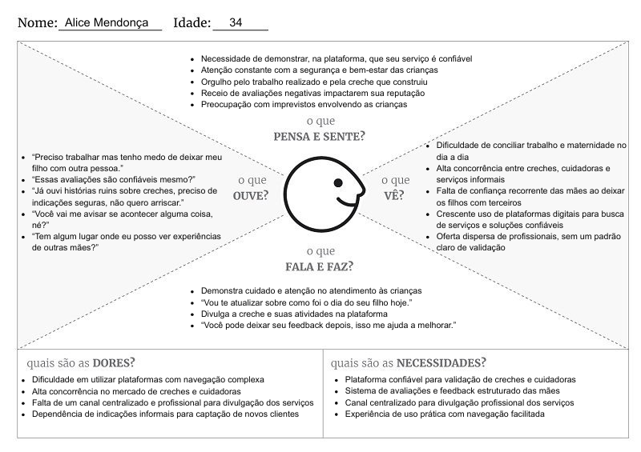

# 4. PROJETO DO DESIGN DE INTERAÇÃO

## 4.1 Personas
Nesta seção você deve detalhar as personas do seu projeto. Deve-se documentar uma persona por integrante do projeto. Para mais informações sobre personas consulte: https://www.rdstation.com/blog/marketing/persona-o-que-e/. Sugere-se a utilização de um template do Canva: https://www.canva.com/pt_br/modelos/s/persona/

## *Tereza Martins  - Creche Mundo Encantado (Tia da limpeza)*
* Sexo: Feminino
* Idade: 48 anos
* Educação: Ensino médio completo
* Ocupação: Auxiliar de limpeza - Creche Mundo Encantado

#### Biografia:
Tereza tem 48 anos e trabalha na limpeza da Creche Mundo Encantado. Mesmo atuando na área de limpeza, ela tem um carinho muito grande pelas crianças e gosta de estar em um ambiente onde pode contribuir, mesmo que de forma indireta, para o bem-estar delas. É uma pessoa simples, dedicada e que valoriza o cuidado com o próximo.

### Objetivo:
* Garantir um ambiente limpo e seguro para as crianças, contribuindo diretamente para a saúde e o bem-estar delas.
* Apoiar o funcionamento da creche, colaborando com a equipe para manter o espaço organizado e acolhedor.
* Promover cuidado e carinho no dia a dia, mesmo em suas atividades de limpeza, ajudando a criar um ambiente mais humano e afetivo.
* Desenvolver-se profissionalmente, buscando melhorar suas práticas de trabalho e aprender novas formas de contribuir na creche.
* Incentivar e apoiar as mães e crianças, sendo uma presença positiva no ambiente, transmitindo atenção, respeito e acolhimento.

## *Dr. Rafael Mendes - Psicólogo para Mães e Filhos*
* Sexo: Masculino
* Idade: 40 anos
* Educação: Ensino superior completo - Psicologia
* Ocupação: Psicólogo de Apoio Materno-Infantil

#### Biografia:
Dr. Rafael Mendes, 40 anos, é psicólogo especialista em desenvolvimento infantil e suporte a famílias monoparentais. Seu trabalho busca compreender profundamente as necessidades, dores e limitações do dia a dia das mães solo.

Atua oferecendo apoio e orientação emocional, com foco em soluções simples, acessíveis e aplicáveis à rotina, ajudando mães a lidarem de forma mais rápida e eficaz com desafios como sobrecarga, comportamento infantil e inseguranças na criação dos filhos.

#### Objetivos:
* Promover o bem-estar emocional de mães e crianças por meio de soluções digitais acessíveis.
* Garantir que o suporte psicológico seja facilmente compreendido e acessado por mães.
* Utilizar ferramentas digitais e sistemas intuitivos que favoreçam uma experiência simples, eficiente e centrada na usuária.
* Fortalecer a confiança no atendimento, mesmo em interações mediadas por plataformas digitais.

## *Dr. João Victor Pele - Advogado para Mães e Famílias*
* Sexo: Masculino
* Idade: 50 anos
* Localização: Rio de Janeiro
* Educação: Ensino superior completo – Direito
* Ocupação: Advogado de Apoio Jurídico para Mães

### Biografia:

Dr. João Victor Pelé, 50 anos, é advogado com atuação voltada ao suporte jurídico de mães, especialmente em situações de vulnerabilidade social. Conhecido por ser uma pessoa empática, paciente e comprometida com causas sociais, valoriza a justiça e acredita na importância da família. Atua em casos como pensão alimentícia, guarda de filhos, reconhecimento de paternidade, oferecendo um atendimento humanizado, com linguagem acessível e utilizando canais digitais para ampliar o acesso à informação e aos direitos.

### Objetivos:

* Garantir que mais mulheres conheçam seus direitos.
* Produzir conteúdo jurídico na plataforma
* Tornar o direito mais acessivel para mães solos
* Ampliar o alcance dos serviços jurídicos por meios digitais.

## *Alice Mendonça - Creche Mundo Encantado*
* Sexo: Feminino
* Idade: 34 anos
* Educação: Ensino superior completo - Bacharel em Administração 
* Ocupação: Empresária e proprietária da Creche Mundo Encantado

#### Biografia:
Alice Mendonça tem 34 anos e é carinhosamente conhecida como “Tia Alice” pelos alunos. Criou a creche após sua experiência pessoal com a maternidade, quando identificou a necessidade de um ambiente confiável e adequado para o desenvolvimento das crianças, especialmente para mães que precisam conciliar trabalho e família.

#### Objetivos:
* Garantir a segurança e o bem-estar das crianças;
* Transmitir confiança e credibilidade às mães;
* Ampliar a visibilidade do seu serviço;
* Construir uma boa reputação por meio de avaliações positivas;
* Oferecer um serviço de qualidade com responsabilidade e profissionalismo.

## *Ana Paula Ferreira*
Ana Paula tem 29 anos, mora em Belo Horizonte, é auxiliar administrativo e mãe solo de um filho de 4 anos. Ela usa o aplicativo para buscar orientação jurídica sobre pensão, apoio emocional e indicações de creche confiável próxima a ela.

## 4.2 Mapa de Empatia
Mapa da Empatia é um material utilizado para conhecer melhor o seu cliente. A partir do mapa da empatia é possível detalhar a personalidade do cliente e compreendê-la melhor. O objetivo é obter um nível mais profundo de compreensão de uma persona. A seguir um exemplo de template que pode ser usado para o mapa de empatia. Para cada persona deverá ser apresentado o seu respectivo mapa de empatia. Sugere-se a utilização do template apresentado em https://www.rdstation.com/blog/marketing/mapa-da-empatia/.

## *Dr. Rafael Mendes*

## *Dr. João Victor Pele*

## *Alice Mendonça*

## *Tereza Martins*

## *Ana Paula Ferreira*

## 4.3 Protótipos das Interfaces
Apresente nesta seção os protótipos de alta fidelidade do sistema proposto. A fidelidade do protótipo refere-se ao nível de detalhes e funcionalidades incorporadas a ele. Assim, um protótipo de alta fidelidade é uma representação interativa do produto, baseada no computador ou em dispositivos móveis. Esse protótipo já apresenta maior semelhança com o design final em termos de detalhes e funcionalidades. No desenvolvimento dos protótipos, devem ser considerados os princípios gestálticos, as recomendações ergonômicas e as regras de design (como as 8 regras de ouro). É importante descrever no texto do relatório como os princípios gestálticos e as regras de ouro foram seguidas no projeto das interfaces. Nesta etapa deve-se dar uma ênfase na implementação do software de modo que possam ser realizados os testes com usuários na etapa seguinte.

## 4.4 Testes com Protótipos
Nesta seção você deve apresentar os testes realizados com usuários utilizando os protótipos de alta fidelidade desenvolvidos na seção anterior. O objetivo é avaliar a usabilidade, a clareza das informações e a adequação do design às necessidades das personas definidas no projeto.

Cada integrante do grupo deverá aplicar o teste com um usuário distinto, preferencialmente alinhado ao perfil das personas criadas. Devem ser definidas previamente as tarefas que o usuário deverá executar no protótipo (por exemplo: realizar um cadastro, buscar um produto, concluir uma compra).

Durante a aplicação do teste, registre observações sobre comportamentos, dúvidas, erros e comentários feitos pelo usuário, bem como o tempo necessário para a execução de cada tarefa. Ao final, colete o feedback do participante, destacando pontos positivos e aspectos a serem melhorados.

Os resultados obtidos por todos os integrantes devem ser consolidados, apresentando uma análise geral com os principais problemas encontrados, oportunidades de melhoria e as ações previstas para o projeto final. 
