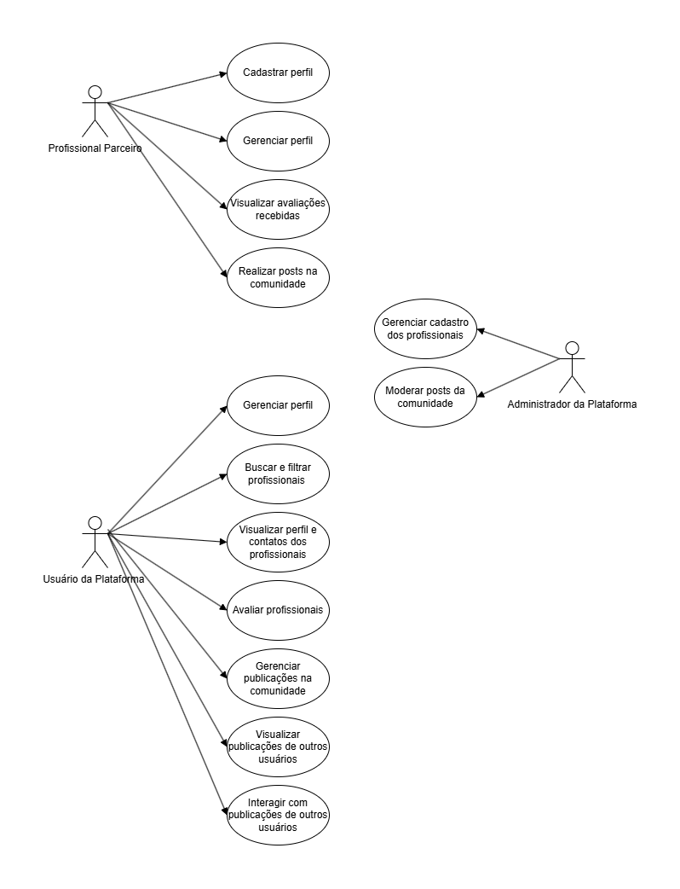

# 3. DOCUMENTO DE ESPECIFICAÇÃO DE REQUISITOS DE SOFTWARE

A presente seção tem como objetivo apresentar a documentação de requisitos do sistema proposto, desenvolvido no contexto do projeto voltado ao apoio de mães solo no mercado de trabalho. O sistema consiste em uma plataforma web que busca centralizar informações e serviços direcionados a esse público, facilitando o acesso a recursos que auxiliem na inserção e permanência dessas mulheres no ambiente profissional.

A plataforma foi concebida como um hub digital que conecta mães solo a profissionais e serviços de apoio, como orientação psicológica, jurídica e cuidados infantis. Dessa forma, o sistema busca contribuir para a redução de barreiras enfrentadas por essas mulheres, promovendo maior autonomia, segurança e acesso a recursos que auxiliem no equilíbrio entre as responsabilidades profissionais e familiares.

## 3.1 Objetivos deste documento

O presente documento tem como objetivo descrever e especificar as necessidades das usuárias do sistema proposto no projeto Mães em Foco, que devem ser atendidas pela plataforma web desenvolvida para apoiar mães solo no acesso a informações e serviços de suporte. O sistema busca facilitar o contato com profissionais de áreas como orientação psicológica, jurídica e cuidados infantis, contribuindo para reduzir dificuldades enfrentadas por essas mulheres em sua rotina e em sua inserção no mercado de trabalho.

Além disso, este documento tem como objetivo apresentar de forma clara os requisitos do sistema, definindo as funcionalidades esperadas e as características necessárias para que a solução atenda às necessidades das usuárias. O desenvolvimento do sistema segue princípios de boas práticas de design e os fundamentos do Design Centrado no Usuário, buscando garantir uma experiência de uso acessível, intuitiva e alinhada às reais necessidades do público-alvo

## 3.2 Escopo do produto

### 3.2.1 Nome do produto e seus componentes principais
O produto será denominado Mães em Foco, um sistema web desenvolvido para apoiar mães solo no acesso a informações e serviços de suporte que possam auxiliá-las em sua rotina e nas demandas relacionadas à maternidade solo, contribuindo também para sua inserção e permanência no mercado de trabalho.

Entre os principais componentes do sistema está o feed de publicações, onde as usuárias podem criar, visualizar e interagir com conteúdos, compartilhando experiências, informações e conteúdos relevantes para outras mães. 

O sistema também contará com uma seção dedicada a profissionais, na qual serão apresentados perfis com informações de especialistas que oferecem serviços de apoio, como orientação psicológica, jurídica, atendimento médico e serviços de cuidado infantil, incluindo babás e creches.

Para se cadastrar na plataforma, o profissional deverá enviar documentação comprobatória de sua habilitação profissional, conforme o órgão regulamentador da respectiva área, por exemplo, advogados deverão informar registro na OAB, psicólogos no CRP, médicos no CRM, entre outros. Essas informações passarão por um processo de validação antes da aprovação do perfil.

Além disso, os profissionais poderão receber avaliações de seus serviços, as quais somente poderão ser realizadas por usuárias que comprovem ter utilizado o atendimento, a plataforma será integrada à api de um sistema de verificação (certificação de reviews - Trustvox).

A comunicação entre usuárias e profissionais ocorrerá por meios externos à plataforma, como WhatsApp e e-mail, por meio de botões de redirecionamento.

### 3.2.2 Missão do produto
Proporcionar um ambiente digital que ofereça apoio e suporte às mães solo em suas rotinas pessoais e profissionais, facilitando o acesso a informações e a profissionais de áreas como orientação psicológica, jurídica e cuidados infantis. O sistema tem como missão tornar esses serviços mais acessíveis e organizados, permitindo que as usuárias encontrem suporte de forma simples, segura e confiável. Além disso, o desenvolvimento da solução segue princípios de Design Centrado no Usuário, buscando compreender as necessidades reais das usuárias e oferecer uma experiência de uso intuitiva, acessível e alinhada às suas demandas.

### 3.2.3 Limites do produto
O sistema não fornece serviços diretos de atendimento profissional, consultas ou intermediação financeira. A plataforma funciona apenas para localização de profissionais e consulta de perfis. A comunicação entre usuárias e profissionais ocorre por meios externos, como WhatsApp e e-mail, através de botões de redirecionamento, não possuindo chat interno próprio.

### 3.2.4 Benefícios do produto

| # | Benefício | Valor para o Cliente |
|--------------------|------------------------------------|----------------------------------------|
|1	|Facilidade no cadastro de perfis de mães solo e profissionais|	Essencial |
|2 |Facilidade na busca e localização de profissionais de apoio próximos | Essencial | 
|3 | Fortalecimento da comunicação e troca de experiências entre mães solo por meio do feed | Recomendável | 
|4	| Segurança no armazenamento de dados das usuárias e profissionais	|Essencial | 
|5	| Acesso centralizado a informações e serviços de apoio	|Essencial | 

## 3.3 Descrição geral do produto

### 3.3.1 Requisitos Funcionais

| Código | Requisito Funcional (Funcionalidade) | Descrição |
|--------------------|------------------------------------|----------------------------------------|
| RF1 | Gerenciar Cadastro de Usuários | Permitir inclusão de usuários do tipo mãe ou prestador de serviço |
| RF2 | Realizar Autenticação de Usuários | Permitir login dos usuários na aplicação |
| RF3 |	Buscar Prestadores de Serviço	| Permitir busca por prestadores cadastrados |
| RF4 | Filtrar Busca de Serviços	| Permitir busca por localização, especialidade e outros filtros |
| RF5	| Visualizar Perfis de Prestadores |	Permitir exibição dos dados e informações dos prestadores de serviço |
| RF6 | Gerenciar Perfis de Usuários	| Permitir edição de perfis de mães e prestadores |
| RF7 | Avaliar Serviços	| Permitir avaliações e comentários sobre prestadores |
| RF8 | Garantir Avaliações Confiáveis   | Permitir a avaliação pela certificadora de reviews |
| RF9 | Gerenciar Interação entre Usuárias | Permitir comentários e interação nas publicações |
| RF10 | Gerenciar Publicações no Feed | Permitir criação, visualização e interação com publicações |
| RF11 | Redirecionar contato para canais externos | Permitir acesso a canais externos de comunicação com profissionais |

### 3.3.2 Requisitos Não Funcionais

| Código | Requisito Não Funcional (Restrição) |
|--------------------|------------------------------------|
| RNF1 | O sistema deve garantir a segurança e privacidade das informações das usuárias. |
| RNF2 | A interface deve ser simples e de fácil utilização. |
| RNF3 | A aplicação deve possuir um design atraente e agradável ao usuário.|
| RNF4 | A aplicação deve ser responsiva, adaptando-se a diferentes tamanhos de tela e dispositivos. |
| RNF5 | A interface deve seguir diretrizes de acessibilidade, facilitando o uso por diferentes perfis de usuárias. |

### 3.3.3 Usuários 

| Ator | Descrição |
|--------------------|------------------------------------|
| Mães Solo |	Usuária da plataforma que pode criar perfil, participar do fórum, fazer publicações, interagir com outras mães e buscar profissionais de apoio próximos.|
| Advogado |	Profissional que pode criar um perfil para oferecer orientação e serviços jurídicos às mães solo. |
| Psicólogo |	Profissional que pode criar um perfil para oferecer apoio psicológico às mães solo. |
| Babá |	Profissional que pode cadastrar seus serviços para auxiliar no cuidado das crianças.|
| Creche |	Instituição que pode cadastrar seu perfil para que mães solo encontrem opções de cuidado infantil próximas.|
| ... |	... |	... |

## 3.4 Modelagem do Sistema

### 3.4.1 Diagrama de Casos de Uso
O diagrama de casos de uso apresenta as principais interações entre os usuários do sistema e suas funcionalidades. Nele, é possível identificar as ações que podem ser realizadas pelas mães solo e pelos prestadores de serviço dentro da plataforma.

#### Figura 1: Diagrama de Casos de Uso do Sistema.

 
### 3.4.2 Descrições de Casos de Uso

#### Cadastrar Profissional (CSU01)

Sumário: O profissional parceiro realiza seu cadastro na plataforma, informando dados pessoais e profissionais, incluindo documentação comprobatória. O administrador da plataforma valida as informações e aprova ou rejeita o cadastro.

Ator Primário: Profissional Parceiro.

Ator Secundário: Administrador da Plataforma.

Pré-condições: O profissional não deve possuir cadastro prévio na plataforma.

Fluxo Principal:

1)  O profissional acessa a funcionalidade de cadastro.
2)  O sistema solicita o preenchimento dos dados pessoais e profissionais.
3)  O profissional informa os dados e envia a documentação comprobatória (ex: OAB, CRP, CRM).
4)  O sistema valida o preenchimento dos campos obrigatórios.
5)  Se os dados forem válidos, o sistema registra o cadastro com status “pendente de aprovação”.
6)  O administrador acessa a lista de cadastros pendentes.
7)  O administrador analisa a documentação enviada.
8)  O administrador aprova o cadastro.
9)  O sistema atualiza o status do profissional para “ativo” e confirma o cadastro.

Fluxo Alternativo (4): Dados inválidos

a) O sistema identifica inconsistências ou ausência de campos obrigatórios. 
b) O sistema informa os erros ao profissional. 
c) O profissional corrige os dados. 
d) O fluxo retorna ao passo 3. 

Fluxo Alternativo (7): Reprovação do cadastro

a) O administrador identifica inconsistências ou documentação inválida. 
b) O administrador rejeita o cadastro. 
c) O sistema atualiza o status para “rejeitado”. 
d) O sistema notifica o profissional para correção ou novo envio. 

Pós-condições: O profissional é cadastrado na plataforma com status “ativo” (aprovado) ou “rejeitado” (pendente de correção).

#### Cadastrar Usuária (CSU02)

Sumário: A usuária realiza seu cadastro na plataforma, informando dados pessoais necessários para criação de sua conta.

Ator Primário: Usuária da Plataforma.

Pré-condições: A usuária não deve possuir cadastro prévio na plataforma.

Fluxo Principal:

1) A usuária acessa a funcionalidade de cadastro.
2) O sistema solicita o preenchimento dos dados pessoais (ex: nome, e-mail, senha, telefone).
3) A usuária informa os dados solicitados.
4) O sistema valida o preenchimento dos campos obrigatórios.
5) Se os dados forem válidos, o sistema registra o cadastro da usuária.
6) O sistema confirma a criação da conta.
7) A usuária pode acessar a plataforma.

Fluxo Alternativo (4): Dados inválidos

a) O sistema identifica inconsistências ou ausência de campos obrigatórios. 
b) O sistema informa os erros à usuária. 
c) A usuária corrige os dados. 
d) O fluxo retorna ao passo 3. 

Fluxo Alternativo (5): Usuária já cadastrada

a) O sistema identifica que já existe cadastro com os dados informados (ex: e-mail). 
b) O sistema informa que a usuária já possui conta. 
c) O sistema sugere acesso ou recuperação de senha. 

Pós-condições: A usuária é cadastrada na plataforma e pode acessar o sistema.

#### Gerenciar Perfil (CSU03)

Sumário: A usuária da plataforma e o profissional parceiro realizam a gestão de seus perfis, incluindo cadastro, visualização e atualização de informações pessoais e profissionais.

Ator Primário: Usuária da Plataforma, Profissional Parceiro.

Pré-condições: O usuário (usuária ou profissional) deve possuir cadastro na plataforma.
O usuário deve estar autenticado no sistema.

Fluxo Principal:

1) 	O usuário acessa a funcionalidade de gerenciamento de perfil.
2) 	O sistema apresenta os dados atuais editáveis do perfil.
3) 	O usuário realiza as alterações desejadas.
4)  Se os dados forem válidos, o sistema atualiza o perfil e confirma a operação.
5) 	O usuário pode continuar editando, o caso de uso retorna ao passo 2; caso contrário o caso de uso termina.

Fluxo Alternativo (4): Dados inválidos

a) O sistema identifica inconsistências ou campos obrigatórios não preenchidos. 
b) O sistema informa o erro ao usuário. 
c) O usuário corrige os dados. 
d) O fluxo retorna ao passo 3. 

Pós-condições: Os dados do perfil do usuário ou profissional foram atualizados com sucesso ou mantidos sem alteração.

#### Buscar e Filtrar Profissionais (CSU04)

Sumário: A usuária da plataforma realiza a busca e aplica filtros para encontrar profissionais cadastrados, de acordo com critérios como área de atuação, localização e avaliações.

Ator Primário: Usuária da Plataforma.

Pré-condições: A usuária deve estar cadastrada e autenticada na plataforma.

Fluxo Principal:

1) A usuária acessa a funcionalidade de busca de profissionais.
2) O sistema apresenta opções de filtro (ex: área de atuação, localização, avaliação).
3) A usuária define os critérios desejados.
4) O sistema processa a busca com base nos filtros informados.
5) O sistema apresenta a lista de profissionais compatíveis.
6) A usuária visualiza os resultados e pode selecionar um perfil para mais detalhes.
7) A usuária pode refinar a busca, retornando ao passo 2; caso contrário, o caso de uso é encerrado.

Fluxo Alternativo (5): Nenhum resultado encontrado

a) O sistema não encontra profissionais com os critérios informados. 
b) O sistema informa a ausência de resultados. 
c) O sistema sugere ajuste nos filtros. 
d) O fluxo retorna ao passo 2. 

Pós-condições: A usuária visualizou uma lista de profissionais de acordo com os critérios definidos ou foi informada sobre a ausência de resultados.

#### Visualizar Perfil do Profissional (CSU05)

Sumário: A usuária da plataforma visualiza o perfil de um profissional, incluindo informações como dados de contato, endereço, área de atuação e avaliações.

Ator Primário: Usuária da Plataforma.

Pré-condições: A usuária deve estar cadastrada e autenticada na plataforma. 
O profissional deve estar com cadastro ativo no sistema.

Fluxo Principal:

1) A usuária realiza a busca de profissionais.
2) O sistema apresenta a lista de profissionais disponíveis.
3) A usuária seleciona um profissional.
4) O sistema exibe o perfil do profissional com informações detalhadas (contato, endereço, área de atuação, avaliações).
5) A usuária visualiza as informações disponíveis.
6) A usuária pode retornar à lista de profissionais ou encerrar o caso de uso.

Fluxo Alternativo (4): Perfil indisponível

a) O sistema identifica que o perfil do profissional está indisponível ou inativo. 
b) O sistema informa a indisponibilidade à usuária. 
c) O fluxo retorna ao passo 2. 

Pós-condições: A usuária visualizou as informações detalhadas de um profissional ou foi informada sobre a indisponibilidade do perfil.

#### Avaliar Profissionais (CSU06)

Sumário: A usuária da plataforma realiza a avaliação de um profissional após a utilização de um serviço (consulta, orientação jurídica ou outro atendimento), sendo a avaliação validada por uma plataforma externa de certificação de reviews.

Ator Primário: Usuária da Plataforma.

Ator Secundário: Plataforma de Verificação de Avaliações.

Pré-condições: A usuária deve estar cadastrada e autenticada na plataforma. 
A usuária deve ter realizado um atendimento com o profissional. 
O profissional deve estar com cadastro ativo no sistema. 

Fluxo Principal:

1) A usuária acessa o perfil do profissional.
2) O sistema apresenta a opção de avaliação.
3) A usuária seleciona a opção de avaliar.
4) O sistema verifica se a usuária possui um atendimento registrado com o profissional.
5) Se a validação for confirmada, o sistema apresenta o formulário de avaliação.
6) A usuária preenche a avaliação (nota, comentário, etc.).
7) O sistema envia a avaliação para a plataforma externa de validação (ex: Trustvox).
8) A plataforma externa valida a autenticidade da avaliação.
9) O sistema registra a avaliação como validada e a associa ao perfil do profissional.
10) O sistema confirma o registro da avaliação à usuária.

Fluxo Alternativo (8): Avaliação não validada

a) A plataforma externa não valida a avaliação. 
b) O sistema registra a avaliação como “não validada” ou a rejeita. 
c) O sistema informa a usuária sobre o status da avaliação. 

Pós-condições: A avaliação é registrada e associada ao profissional, com status validado ou não validado pela plataforma externa.

#### Gerenciar Publicações na Comunidade (CSU07)

Sumário: A usuária da plataforma e o profissional parceiro podem criar, editar, excluir, visualizar e interagir com publicações na comunidade, incluindo ações de curtir, comentar e denunciar conteúdos. A administração pode moderar conteúdos publicados.

Ator Primário: Usuária da Plataforma, Profissional Parceiro.

Ator Secundário: Administrador da Plataforma.

Pré-condições: O usuário (usuária ou profissional) deve estar cadastrado e autenticado na plataforma.

Fluxo Principal:

1) O usuário acessa a área da comunidade.
2) O sistema apresenta a lista de publicações existentes.
3) O usuário visualiza as publicações disponíveis.
4) O usuário pode selecionar uma publicação para visualizar detalhes.
5) O sistema exibe o conteúdo completo da publicação, incluindo comentários e curtidas.
6) O usuário pode optar por interagir (curtir, comentar ou reportar) ou gerenciar publicações próprias.
7) Caso opte por criar uma nova publicação, o usuário insere o conteúdo e solicita a publicação.
8) O sistema registra e exibe a nova publicação na comunidade.
9) O usuário pode continuar interagindo ou encerrar o caso de uso.

Fluxo Alternativo (6): Curtir publicação

a) O usuário seleciona a opção de curtir uma publicação. 
b) O sistema registra a curtida. 
c) O sistema atualiza o contador de curtidas. 

Fluxo Alternativo (6): Comentar publicação

a) O usuário seleciona a opção de comentar. 
b) O sistema apresenta o campo de comentário. 
c) O usuário insere o conteúdo e envia. 
d) O sistema registra e exibe o comentário na publicação. 

Fluxo Alternativo (6): Reportar publicação/comentário

a) O usuário seleciona a opção de denúncia. 
b) O sistema apresenta os motivos da denúncia (ex: conteúdo impróprio, spam, linguagem ofensiva). 
c) O usuário seleciona o motivo e confirma. 
d) O sistema registra a denúncia e a encaminha para moderação. 

Fluxo Alternativo (6): Editar publicação

a) O usuário seleciona uma publicação de sua autoria. 
b) O sistema permite a edição do conteúdo. 
c) O usuário realiza as alterações. 
d) O sistema atualiza a publicação. 

Fluxo Alternativo (6): Excluir publicação

a) O usuário seleciona uma publicação de sua autoria. 
b) O usuário solicita a exclusão. 
c) O sistema remove a publicação da comunidade. 

Fluxo Alternativo (Moderação): Ação do administrador

a) O administrador acessa a área de moderação. 
b) O sistema apresenta as publicações e comentários reportados. 
c) O administrador analisa o conteúdo denunciado. 
d) O administrador decide pela manutenção, edição ou remoção do conteúdo. 
e) O sistema aplica a ação e atualiza a comunidade. 

Pós-condições: Publicações podem ser criadas, editadas ou removidas, interações podem ser registradas e conteúdos podem ser denunciados e moderados pela administração.

### 3.4.3 Diagrama de Classes 

O diagrama de classes do sistema Mães em Foco apresenta a estrutura lógica da plataforma, destacando o papel do Administrador na gestão de usuárias e na validação obrigatória dos Profissionais além de moderarem publicações do fórum. A relação entre esses perfis permite que as mães realizem buscas por especialistas e iniciem contatos diretos para suporte.

As interações na comunidade ocorrem através da classe Publicação, onde cada postagem é vinculada a uma única Usuária autora, permitindo a moderação de conteúdos pelo administrador. Complementando o sistema, a classe Avaliação registra o feedback das usuárias sobre o atendimento recebido. Cada registro de avaliação conecta obrigatoriamente uma autora a um único profissional, garantindo que um especialista possa acumular diversas notas e comentários ao longo do tempo, mantendo a transparência e a segurança da rede de apoio.

#### Figura 2: Diagrama de Classes do Sistema.

Abaixo, apresentamos a estrutura completa do sistema Mães em Foco. Para garantir a legibilidade de todos os atributos e métodos, o diagrama foi dividido em duas seções de visualização detalhada:

 #### Parte 1: Gestão de Usuárias e Publicações

#### Parte 2: Profissionais e Sistema de Avaliações

### 3.4.4 Descrições das Classes 

| # | Nome | Descrição |
|--------------------|------------------------------------|----------------------------------------|
| 1	|	Usuaria |Representa as mães solo que utilizam a plataforma para buscar apoio, interagir na comunidade e avaliar profissionais. |
| 2	| Profissional |	Armazena os dados dos prestadores de serviços (psicólogos, advogados, etc.) que oferecem suporte especializado às usuárias. |
| 3 |	Administrador | Responsável pelo gerenciamento do sistema, incluindo a validação de documentos dos profissionais e moderação de conteúdos. |
| 4 |	Publicação |	Registra as interações e postagens feitas pelas usuárias na comunidade, permitindo a troca de experiências e informações. |
| 5	|	Avaliação | Guarda o feedback e a nota dada pelas usuárias aos profissionais, garantindo a qualidade e segurança dos serviços prestados. |

